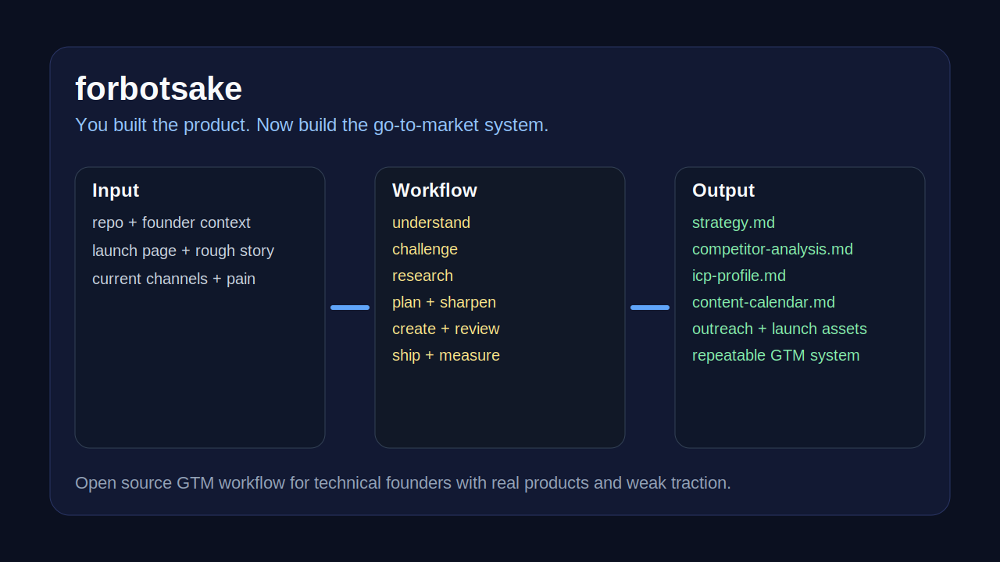
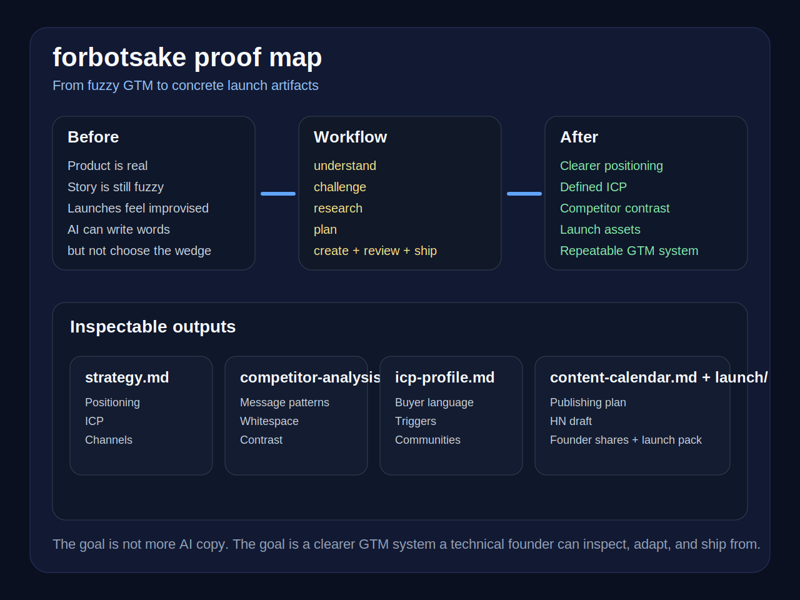

# forbotsake

[](LICENSE)
[](https://docs.anthropic.com/en/docs/claude-code)

The open-source GTM workflow for technical founders who built something real and still got weak traction.

You built the product.
Now build the go-to-market system.





forbotsake turns a repo, a rough launch story, and a founder's context into:
- sharper positioning
- clearer ICP
- competitor contrast
- content and launch assets
- outreach plans
- repeatable distribution workflows

This is not another AI copy toy.
It is a marketing operating system for technical founders.

## Why this exists

AI made building much easier.
That shifted the bottleneck.

A lot of technical founders do not have a product problem anymore.
They have a translation problem:
- what exactly is this?
- who is it for?
- why now?
- what should I say first?
- where should this actually go?

forbotsake exists to answer those questions before you spray content everywhere.

## What you get in 10 minutes

Run the first skill and you do not get a generic blog post.
You get working GTM artifacts.

- `strategy.md`
  - positioning, ICP, channels, messaging pillars
- `founder-profile.md`
  - context, relationships, unfair advantages
- `competitor-analysis.md`
  - messaging matrix and whitespace
- `icp-profile.md`
  - real audience language, communities, triggers
- `content-calendar.md`
  - what to publish, where, and why
- `content/*`
  - actual posts, threads, emails, launch copy

See a concrete walkthrough in [examples/what-you-get-in-10-minutes.md](examples/what-you-get-in-10-minutes.md).

If you want the fastest proof of what changes between before and after, start with [examples/proof-demo.md](examples/proof-demo.md).

## Who this is for

forbotsake is for:
- devtool founders
- AI tool founders
- OSS maintainers with commercialization intent
- technical founders who shipped v1 but still have weak distribution

Especially if this sounds familiar:
- the repo has stars but no real pipeline
- launches feel rushed and vague
- you can build fast but do not know how to position the thing cleanly
- generic AI marketing tools give you motion, not traction

## What makes this different

Most AI marketing tools start with:
- write a blog post
- write a tweet
- write a launch thread

forbotsake starts earlier.

It asks:
- who exactly has this problem?
- what do they do today instead?
- what category are you really in?
- what are competitors saying?
- where does your buyer actually pay attention?

Thinking first.
Then execution.

## Why this beats generic AI copy tools

Generic AI copy tools are good at producing words.
They are bad at:
- choosing the right wedge
- rejecting weak positioning
- grounding messaging in a specific ICP
- finding whitespace in a real market
- turning a founder's context into a repeatable GTM system

forbotsake is opinionated on purpose.

## Install

### Option 1: one-liner
```bash
bash <(curl -fsSL https://raw.githubusercontent.com/forbotsake/forbotsake/main/bin/install.sh)
```

### Option 2: manual
```bash
git clone --single-branch --depth 1 https://github.com/forbotsake/forbotsake.git ~/.claude/skills/forbotsake
bash ~/.claude/skills/forbotsake/bin/sync-links.sh
```

No build step for core skills.
Optional extras:
- bun/node for text-card generation
- browser automation for publishing and visual generation

Verify install:
```bash
bash ~/.claude/skills/forbotsake/bin/sync-links.sh --check
```

## Quick start

1. Install
2. Open your project in Claude Code
3. Run `/forbotsake-marketing-start`
4. Answer 6 hard questions
5. Work down the pipeline

## The pipeline

```text
UNDERSTAND -> CHALLENGE -> RESEARCH -> PLAN -> SHARPEN -> CREATE -> REVIEW -> SHIP -> MEASURE
```

| Stage | Command | What it does |
|---|---|---|
| Understand | `/forbotsake-marketing-start` | Build strategy.md, founder-profile.md, brand.md |
| Challenge | `/forbotsake-cmo-check` | Attack your strategy and tighten it |
| Research | `/forbotsake-spy` | Analyze competitors and whitespace |
| Research | `/forbotsake-icp` | Deep audience research |
| Plan | `/forbotsake-content-plan` | Build channel and content plan |
| Sharpen | `/forbotsake-sharpen` | Go deep on one target or account |
| Create | `/forbotsake-create` | Write actual content and assets |
| Review | `/forbotsake-content-check` | Catch slop, drift, weak hooks, weak CTA |
| Ship | `/forbotsake-publish` | Format or publish approved content |
| Measure | `/forbotsake-retro` | Review what worked and what to change |

## Proof, not theory

This repo already contains:
- strategy artifacts
- competitor analysis
- ICP profiles
- launch content drafts
- outreach systems
- automated review gates

If you want to inspect the shape of the outputs first:
- [examples/proof-demo.md](examples/proof-demo.md)
- [examples/what-you-get-in-10-minutes.md](examples/what-you-get-in-10-minutes.md)
- [docs/repo-positioning-notes.md](docs/repo-positioning-notes.md)
- [docs/repo-launch-week-plan.md](docs/repo-launch-week-plan.md)

## Launch principle

A technical founder should be able to look at this repo and immediately think:

“I know exactly why this exists.
I know who it is for.
I know what I would get if I ran it.
I know why this is different from generic AI marketing slop.”

If the repo does not create that reaction, the repo is still under-positioned.

## Contributing

Found a bug or have a skill idea?
Open an issue.

Pull requests are welcome.
forbotsake skills are markdown-heavy by design.
If you can write sharp prompts and sharp workflows, you can contribute.

## License

MIT
